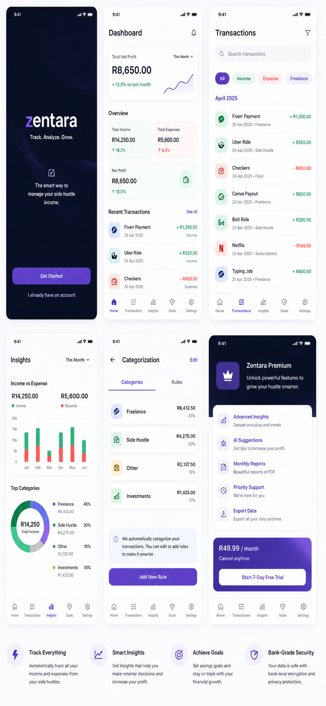
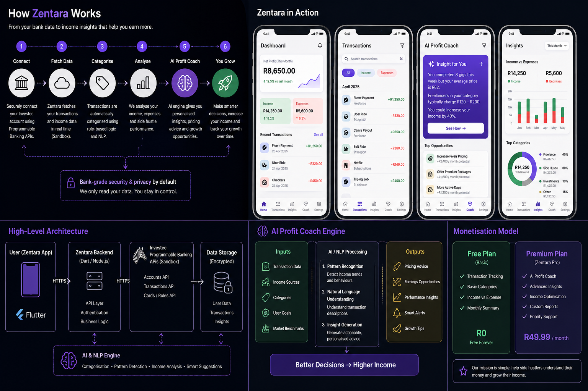

# Zentara APP
AI-powered income intelligence for freelancers, side hustlers, and independent workers.

**Version 1.0.0 | Investec Programmable Banking + AI-driven income insights**

Zentara is a financial intelligence platform designed to help freelancers understand not only where money goes, but how income grows.

Traditional finance apps focus on expense tracking.

Zentara focuses on **income visibility, profitability, and growth opportunities.**

Using Investec Programmable Banking transaction data, Zentara analyses earnings, expenses, and transaction behaviour to generate insights that help users understand their financial performance and make better decisions.

## 📱 Zentara in Action

## ⚙️ Architecture

---

## The Problem

Freelancers and side hustlers often receive income from multiple sources:

- Freelance projects
- Side businesses
- Contract work
- Gig platforms
- Small services

Most banking applications show balances and spending history, but they do not answer questions such as:

- Which income source performs best?
- Am I profitable this month?
- How much am I actually earning?
- Which activities increase income?

This creates a gap in financial visibility for independent workers.

---

## Solution

Zentara transforms transaction data into income intelligence.

The platform analyses user transactions and provides:

- Income tracking
- Expense monitoring
- Smart categorisation
- Net profit analysis
- AI-generated insights
- Growth recommendations
- Performance summaries

---

## Investec Integration

Zentara uses Investec Programmable Banking (Sandbox) as a core component of the platform.

Current integration scope:

- Transaction history
- Account insights
- Categorisation pipeline
- Income analysis engine
- Future card/rule automation support

Investec integration is used as part of the financial intelligence layer rather than simple balance visualisation.

---

## AI Profit Coach

The AI insight engine analyses:

Inputs:
- Transactions
- Income sources
- Categories
- Goals
- Performance trends

Outputs:
- Pricing recommendations
- Earnings opportunities
- Growth insights
- Smart alerts
- Monthly performance reports

---

## Monetisation

### Free Tier
- Transaction tracking
- Income analysis
- Monthly summaries

### Zentara Premium (R49.99/month)

- AI Profit Coach
- Advanced analytics
- Growth recommendations
- Reports
- Enhanced insights

---

## Technology

Frontend:
- Flutter / Web Prototype
- v0-assisted UI prototyping

Backend:
- API integration layer
- AI insight engine

Banking:
- Investec Programmable Banking (Sandbox)

---

## Development Note

This project includes AI-assisted prototyping tools for rapid UI visualisation and concept validation.

Product concept, architecture direction, feature design, documentation, and integration planning were created by the developer.

---

Track. Analyse. Grow.
